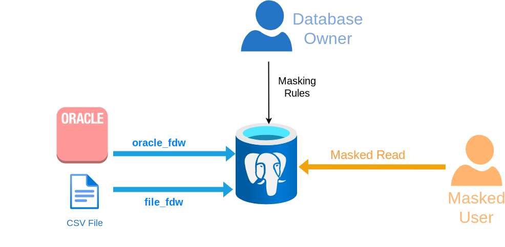

Masking Data Wrappers
===============================================================================

The principle of a masking data wrappers is to use Postgres as a "masking proxy"
in front of any type of external data source. Using [Foreign Data Wrappers],
we can apply masking rules to data stored in CSV files, in another RDBM, in a
NoSQL store, in a LDAP directory, etc.



Of course the remote data source can be another PostgreSQL instance !

[Foreign Data Wrappers]: https://wiki.postgresql.org/wiki/Foreign_data_wrappers


Example
--------------------------------------------------------------------------------

Here's a basic CSV file containing  application logs

``` bash
$ cat /tmp/app.log
Mon Nov 04 08:25:32 2024        sarah   10.0.0.45       view_dashboard
Mon Nov 04 09:15:00 2024        mike    172.16.0.89     update_profile
Mon Nov 04 09:30:45 2024        emma    192.168.2.200   download_report
[...]
```

Let's create a foreign table based on this file

``` sql
CREATE EXTENSION IF NOT EXISTS file_fdw;

CREATE SERVER external_files FOREIGN DATA WRAPPER file_fdw;

CREATE SCHEMA files;

CREATE FOREIGN TABLE files.app_log
(
    tms   TIMESTAMP,
    login VARCHAR(255),
    ip INET,
    action TEXT
)
  SERVER external_files
  OPTIONS ( filename '/tmp/app.log' )
;
```

We can now declare masking rules on the columns of the foreign table, just like
we would do for a regular table.

``` sql
SECURITY LABEL FOR anon ON COLUMN files.app_log.login
  IS 'MASKED WITH VALUE $$CONFIDENTIAL$$';

SECURITY LABEL FOR anon ON COLUMN files.app_log.ip
  IS 'MASKED WITH FUNCTION anon.dummy_ipv4()';
```

... and that's it ! The masked users will now see the filtered data :


``` sql
SET ROLE some_masked_user;

SELECT * FROM files.app_log LIMIT 1;
           tms            |    login     |      ip      |    action
--------------------------+--------------+--------------+---------------
 Mon Nov 04 08:23:15 2024 | CONFIDENTIAL | 85.249.91.21 | login_success
```

Or export the data to a new CSV file

``` sql
SET ROLE some_masked_user;

COPY files.app_log TO '/tmp/anonymized_app.log'
```


