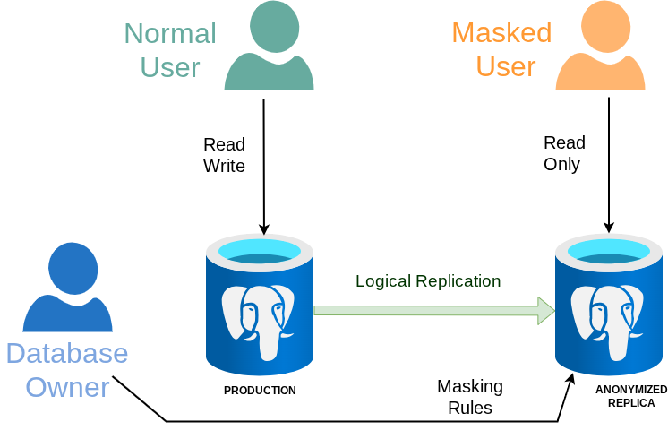
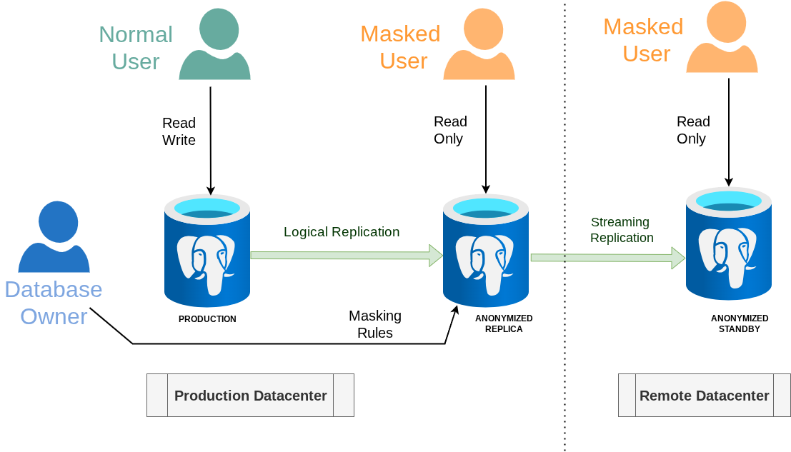

Anonymous Replica
===============================================================================

Principle
-------------------------------------------------------------------------------

In some situations, you may want to have an anonymized copy of your
production database on another instance like with [Backup Masking]
(aka "Anonymized Dumps") but you also would like this copy to be up-to-date
with the original data like with [Dynamic Masking]...

With the Replica Masking feature, you can use PostgreSQL logical replication
to create an anonymized clone of your production database.



[Backup Masking]: anonymous_dumps.md
[Dynamic Masking]: dynamic_masking.md


Preamble: Learn about logical replication !
-------------------------------------------------------------------------------

PostgreSQL logical replication is a powerful mechanism. Before setting up a
anonymous replica, be sure that you are able to configure standard logical
replication correctly.

There are many tutorials available for that and we also recommend reading the
PostgreSQL manual:

<https://www.postgresql.org/docs/current/logical-replication.html>


Quick Setup
-------------------------------------------------------------------------------

### Example

Let's say we want to anonymize a table `person` in a database `foo` like this:

```sql
CREATE TABLE person (
  id SERIAL PRIMARY KEY,
  name TEXT,
  company TEXT
);


INSERT INTO person VALUES (1, 'Alice', 'CompanyA');
INSERT INTO person VALUES (2, 'Bob', 'CompanyB');
INSERT INTO person VALUES (3, 'Charlie', 'CompanyC');
INSERT INTO person VALUES (4, 'David', 'CompanyD');
INSERT INTO person VALUES (5, 'Eve', 'CompanyE');

```

### A- On the publisher database

A1- Create a replication role:

```sql
CREATE ROLE anon_replicator LOGIN REPLICATION PASSWORD 'CHANGE-ME-3747';
GRANT USAGE  ON SCHEMA public TO anon_replicator;
GRANT SELECT ON ALL TABLES IN SCHEMA public TO anon_replicator;
```

Be sure to configure your `pg_hba.conf` file to allow `anon_replicator` to
connect from the subscriber database.


A2- Create a publication:

```sql
CREATE PUBLICATION pub FOR TABLE person;
```

All of this is pretty standard. There's nothing special regarding anonymization
on the publisher database. In fact, the publisher database “does not know”
that the data will be masked on the subscriber.

### B- On the subscriber database

B1- Create the table ( DDL commands are NOT replicated ):

```sql
CREATE TABLE person (
  id SERIAL PRIMARY KEY,
  name TEXT,
  company TEXT
);

```

B2- Enable replica masking:

```sql
ALTER DATABASE foo SET anon.replica_masking TO on;
```

B3- Reconnect to the database so that the configuration is applied.

B4- Define the masking rules:

```sql
SECURITY LABEL FOR anon ON COLUMN person.company
  IS 'MASKED WITH FUNCTION pg_catalog.md5(company)';

SECURITY LABEL FOR anon ON COLUMN person.name
  IS 'MASKED WITH FUNCTION anon.dummy_first_name()';
```

B5- start the replica masking engine:

```sql
SELECT anon.start_replica_masking();
```

B6- Create the subscription:

```sql
CREATE SUBSCRIPTION anon_sub
CONNECTION 'host=prod_srv user=anon_replicator password=CHANGE-ME-3747 dbname=foo'
PUBLICATION pub;
```

Wait for a few milliseconds while the data is being synchronized and masked...

Et voilà !


```sql
SELECT * FROM person;

 id |   name    |             company
----+-----------+----------------------------------
  1 | Christine | a1e551387ba94e882ccc5356948d6462
  2 | Percival  | 75b4e152a05dae2f1d7991182e707fad
  3 | Ignatius  | e2a211f97064ee5a86853ae61e1bb2b9
  4 | Karley    | 8d543957c23828bb0d888cf7da59a817
  5 | Alfredo   | 566ca1969819cbf2098202255914bf23
```

Changing the masking rules
-------------------------------------------------------------------------------

Anytime you add or remove a masking rule, you need to update the replica masking
engine.

```sql
SELECT anon.refresh_replica_masking();
```

Anonymized Standby
-------------------------------------------------------------------------------

In complement to Replica Masking, it is possible to use Hot Standby replication
to build a distant clone of the Anonymized Replica. This is useful to export
the database to a remote datacenter because the Anonymized Replica will operate
as a masking proxy, "cleaning" the personal information before it gets
transferred to the Standby instance.




Security
-------------------------------------------------------------------------------

Keep in mind that the masking rules are applied on-the-fly in the subscriber
database, which means:

* The original data is transferred through the connection between the publisher
  and the subscriber. Therefore this connection should be protected like
  in a regular logical replication setup.

* The superuser of the subscriber instance and the owner of the subscriber
  database can disable Replica Masking at anytime. They can both access the
  original, just like the superuser and the owner of the publisher database.
  Therefore, a third role should be created on the subscriber database to provide
  unprivileged and read-only access to the data.

* The replication role is also able to access the original data at any time.

* The logs of the subscriber database may contain unmasked data.


Limitations
-------------------------------------------------------------------------------

* Anonymous replication is based on logical replication, therefore it has the
  same [restrictions], in particular: DDL commands, sequences, Large Objects
  are NOT replicated.

* The `REPLICA IDENTITY FULL` method is NOT supported. This means that all
  replicated tables MUST have a primary key.

* The primary key of a table should not be masked.

[restrictions]: https://www.postgresql.org/docs/current/logical-replication-restrictions.html


But I want to anonymize a primary key!
-------------------------------------------------------------------------------

If you need to anonymize a primary key in a table, this means that it is a
natural key (as opposed to a [surrogate key]).

[surrogate key]: https://en.wikipedia.org/wiki/Surrogate_key

Natural keys are problematic for many reasons:

* they can change over time (like email addresses or product codes), forcing
  cascading updates throughout related tables
* they're often not truly unique in practice, even seemingly unique values
  like SSNs can have duplicates or exceptions
* they tend to be longer and more complex than simple integers
* they make joins slower and indexes larger
* they can contain sensitive information that you might not want exposed in
  URLs or logs.
* they may change whenever business rules evolve, requiring database
  restructuring.

Surrogate keys (i.e. auto-incrementing integers) avoid these issues by
providing stable, meaningless identifiers that never need to change.

In particular for anonymization: surrogate keys make your life easier since you
don't have to mask them.
In the other hand, natural keys are often a nightmare: in most situations they
will force you to use complex pseudonymization techniques, and keep in mind that
that [Pseudonymization Is Not Anonymization] !

[Pseudonymization Is Not Anonymization]: masking_functions.md#pseudonymization
