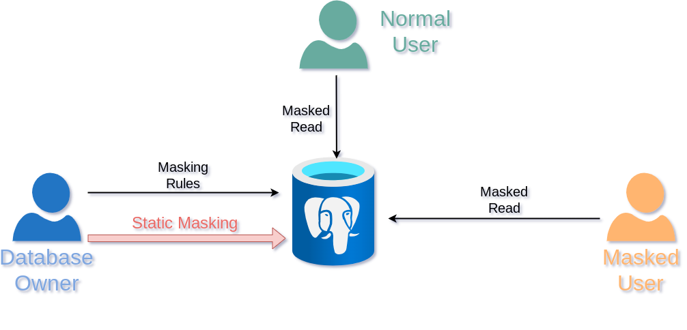

Permanently remove sensitive data
===============================================================================

Sometimes, it is useful to transform directly the original dataset. You can
do that with different methods:

* [Applying masking rules](#applying-masking-rules)
* [Shuffling a column](#shuffling)
* [Adding noise to a column](#adding-noise-to-a-column)


**These methods will destroy the original data. Use with care.**



Applying masking rules
--------------------------------------------------------------------------------

You can permanently apply the [masking rules] of a database with
`anon.anonymize_database()`.

[masking rules]: declare_masking_rules.md


Let's use a basic example :

```sql

CREATE TABLE customer(
  id SERIAL,
  full_name TEXT,
  birth DATE,
  employer TEXT,
  zipcode TEXT,
  fk_shop INTEGER
);

INSERT INTO customer
VALUES
(911,'Chuck Norris','1940-03-10','Texas Rangers', '75001',12),
(312,'David Hasselhoff','1952-07-17','Baywatch', '90001',423)
;

SELECT * FROM customer;

 id  |   full_name      |   birth    |    employer   | zipcode | fk_shop
-----+------------------+------------+---------------+---------+---------
 911 | Chuck Norris     | 1940-03-10 | Texas Rangers | 75001   | 12
 112 | David Hasselhoff | 1952-07-17 | Baywatch      | 90001   | 423

```

Step 1: Load the extension :

```sql
CREATE EXTENSION IF NOT EXISTS anon CASCADE;
SELECT anon.init();
```

Step 2: Declare the masking rules

```sql
SECURITY LABEL FOR anon ON COLUMN customer.full_name
IS 'MASKED WITH FUNCTION anon.dummy_name()';

SECURITY LABEL FOR anon ON COLUMN customer.employer
IS 'MASKED WITH FUNCTION anon.dummy_company_name()';

SECURITY LABEL FOR anon ON COLUMN customer.zipcode
IS 'MASKED WITH FUNCTION anon.random_zip()';
```


Step 3: Replace authentic data in the masked columns :

```sql
SELECT anon.anonymize_database();

SELECT * FROM customer;

 id  |  full_name  |   birth    |      employer           | zipcode | fk_shop
-----+-------------+------------+-------------------------+---------+---------
 911 | jesse Kosel | 1940-03-10 | Marigold Properties LLC | 62172   |      12
 312 | leolin Bose | 1952-07-17 | Inventure Inc           | 20026   |     423

```


You can also use `anonymize_table()` and `anonymize_column()` to remove data from
a subset of the database :

```sql
SELECT anon.anonymize_table('customer');
SELECT anon.anonymize_column('customer','zipcode');
```

**WARNING** : **Static masking is a slow process**. The principle of
static masking is to update all lines of all tables containing at
least one masked column. This basically means that PostgreSQL will rewrite
all the data on disk. Depending on the database size, the hardware and the
instance config, it may be faster to export the anonymized data (See
[Anonymous Dumps] ) and reload it into the database.

Disabling Static Masking
------------------------------------------------------------------------------

You may be scared that someone could accidentally run `anon.anonymize_database()`
and wipe out all the data.

If so, you can disable this feature globally with:

``` sql
ALTER SYSTEM SET anon.static_masking TO off
```

Or disable it for a single user :

```sql
ALTER ROLE bob SET anon.static_masking TO off;
```

Or disable it everyone except one user

```sql
ALTER DATABASE mydb SET anon.static_masking = FALSE;
ALTER ROLE daniel SET anon.static_masking = TRUE;
```

Static Masking and Multiple Masking Policies
------------------------------------------------------------------------------

When using multiple masking policies, you can simply add the policy name at
the end of the static masking functions.

For instance, if you defined a masking policy named "rgpd", you can apply it with

```sql
SELECT anon.anonymize_table('customer','rgpd');
SELECT anon.anonymize_column('customer','zipcode','rgpd');
```

By default, there's a single masking policy named "anon".


Parallel Static Masking
------------------------------------------------------------------------------

For large databases, static masking can be a time-consuming operation. To improve
performance, the extension supports parallel static masking using PostgreSQL
background workers.

Instead of using `anon.anonymize_database()`, you can use the parallel version:

```sql
SELECT anon.anonymize_database_parallel(4);
```

The parameter specifies the number of parallel workers to use. The function will:

1. Analyze the foreign key relationships between tables
2. Group tables to avoid constraint violations
3. Distribute the work across multiple background workers
4. Process tables in parallel where possible

The maximum number of background workers can be configured using the GUC parameter
`anon.max_bg_workers`:

```sql
-- Set the maximum number of background workers (default: 4)
SET anon.max_bg_workers = 8;

-- Or configure it system-wide
ALTER SYSTEM SET anon.max_bg_workers = 8;
SELECT pg_reload_conf();
```

The `anon.max_bg_workers` parameter accepts values between 1 and 64.
On servers with many CPUs, you may want to increase this value to improve
performance. The value is capped by PostgreSQL's guc: `max_worker_processes`
(default: 8).

Important considerations:

* **Foreign Keys**: Tables with foreign key relationships are grouped together
  and processed sequentially to maintain referential integrity.
* **Independent Tables**: Tables without foreign key relationships can be
  processed in parallel.
* **Resource Usage**: More workers mean more CPU and I/O usage.
  Monitor your system resources when increasing this value.
* **Worker Availability**: The actual number of workers used may be limited by
  PostgreSQL's `max_worker_processes` configuration.
* **Logs**: In this first version of parallel static masking, dynmic background
  workers are used. So there is no communication between main and background
  process. That's why errors are logged into the PostgreSQL log file, but not
  in stdout. If anonymize_database_parallel response is False, then check pg logs.
* **atomic function**: The anon.anonymize_database_parallel() is NOT an atomic
  function. If a worker fails, the others will not rollback, leaving the database
  in an intermediate state: some tables will be anonymized, while others will
  remain unchanged. In such situation, check the logs to find which tables were
  not anonymized, and retry to apply the masking rules with anon.anonymize_table().

Shuffling
------------------------------------------------------------------------------

 **Shuffling** mixes values within the same columns.

* `anon.shuffle_column(shuffle_table, shuffle_column, primary_key)` will rearrange
  all values in a given column. You need to provide a primary key of the table.

This is useful for foreign keys because referential integrity will be kept.

**IMPORTANT:**  `shuffle_column()` is not a [masking function] because it works
"vertically" : it will modify all the values of a column at once.

[masking function]: masking_functions.md

Adding noise to a column
--------------------------------------------------------------------------------


There are also some functions that can add noise on an entire column:

* `anon.add_noise_on_numeric_column(table, column, ratio)` if ratio = 0.33, all
  values of the column will be randomly shifted with a ratio of +/- 33%

* `anon.add_noise_on_datetime_column(table, column, interval)` if interval = '2 days',
  all values of the column will be randomly shifted by +/- 2 days

**IMPORTANT** : These noise functions are vulnerable to a form of
repeat attack. See `demo/noise_reduction_attack.sql` for more details.
