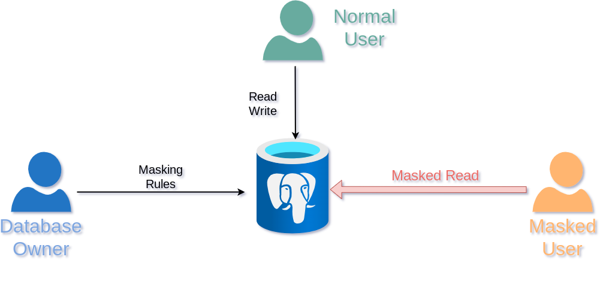

# 2- How to use Dynamic Masking

> With Dynamic Masking, the database owner can hide personal data for
> some users, while other users are still allowed to read and write the
> authentic data.

## The Story

Paul has 2 employees:

-   Jack is operating the new sales application, he needs access to the
    real data. He is what the GPDR would call a **\"data processor\"**.
-   Pierre is a data analyst who runs statistic queries on the database.
    He should not have access to any personal data.

## How it works



## Objectives

In this section, we will learn:

-   How to write simple masking rules
-   The advantage and limitations of dynamic masking
-   The concept of \"Linkability\" of a person

## The `company` table

``` sql
DROP TABLE IF EXISTS supplier CASCADE;
DROP TABLE IF EXISTS company CASCADE;
CREATE TABLE company ( id SERIAL PRIMARY KEY, name TEXT, vat_id TEXT UNIQUE );
```

``` sql
INSERT INTO company
VALUES (952,'Shadrach', 'FR62684255667'),
       (194,E'Johnny\'s Shoe Store','CHE670945644'),
       (346,'Capitol Records','GB663829617823') ;
```

``` sql
SELECT *
FROM company;
```

| id  | name                 | vat_id         |
|-----|----------------------|----------------|
| 952 | Shadrach             | FR62684255667  |
| 194 | Johnny\'s Shoe Store | CHE670945644   |
| 346 | Capitol Records      | GB663829617823 |

## The `supplier` table

``` sql
CREATE TABLE supplier ( id SERIAL PRIMARY KEY, fk_company_id INT REFERENCES company(id), contact TEXT, phone TEXT, job_title TEXT );
```

``` sql
INSERT INTO supplier
VALUES (299,194,'Johnny Ryall','597-500-569','CEO'),
       (157,346,'George Clinton', '131-002-530','Sales manager') ;
```

``` sql
SELECT *
FROM supplier;
```

| id  | fk_company_id | contact        | phone       | job_title     |
|-----|---------------|----------------|-------------|---------------|
| 299 | 194           | Johnny Ryall   | 597-500-569 | CEO           |
| 157 | 346           | George Clinton | 131-002-530 | Sales manager |

## Activate the extension

``` sql
ALTER DATABASE boutique
SET session_preload_libraries TO 'anon';


CREATE EXTENSION IF NOT EXISTS anon;


SELECT anon.init();
```

## Dynamic Masking

### Activate the masking engine

``` sql
ALTER DATABASE boutique SET anon.transparent_dynamic_masking TO true;
```

### Masking a role

``` sql
SECURITY LABEL
FOR anon ON ROLE pierre IS 'MASKED';

GRANT pg_read_all_data TO pierre;
```

Now connect as Pierre and try to read the supplier table:

``` sql
SELECT *
FROM supplier;
```

| id  | fk_company_id | contact        | phone       | job_title     |
|-----|---------------|----------------|-------------|---------------|
| 299 | 194           | Johnny Ryall   | 597-500-569 | CEO           |
| 157 | 346           | George Clinton | 131-002-530 | Sales manager |

For the moment, there is no masking rule so Pierre can see the original
data in each table.

## Masking the supplier names

Connect as Paul and define a masking rule on the supplier table:

``` sql
SECURITY LABEL
FOR anon ON COLUMN supplier.contact IS 'MASKED WITH VALUE $$CONFIDENTIAL$$';
```

------------------------------------------------------------------------

Now connect as Pierre and try to read the supplier table again:

``` sql
SELECT *
FROM supplier;
```

| id  | fk_company_id | contact      | phone       | job_title     |
|-----|---------------|--------------|-------------|---------------|
| 299 | 194           | CONFIDENTIAL | 597-500-569 | CEO           |
| 157 | 346           | CONFIDENTIAL | 131-002-530 | Sales manager |

------------------------------------------------------------------------

Now connect as Jack and try to read the real data:

``` sql
SELECT *
FROM supplier;
```

| id  | fk_company_id | contact        | phone       | job_title     |
|-----|---------------|----------------|-------------|---------------|
| 299 | 194           | Johnny Ryall   | 597-500-569 | CEO           |
| 157 | 346           | George Clinton | 131-002-530 | Sales manager |

## Exercices

### E201 - Guess who is the CEO of "Johnny's Shoe Store"

Masking the supplier name is clearly not enough to provide anonymity.

**Connect as Pierre and write a simple SQL query that would reindentify
some suppliers based on their job and their company.**

Company names and job positions are available in many public datasets. A
simple search on Linkedin or Google, would give you the names of the top
executives of most companies..

> This is called **Linkability**: the ability to connect multiple
> records concerning the same data subject.

### E202 - Anonymize the companies

We need to anonymize the `company` table, too. Even if they don't
contain personal information, some fields can be used to **infer** the
identity of their employees...

**Write 2 masking rules for the company table. The first one will
replace the `name` field with a fake name. The second will replace the
`vat_id` with a random sequence of 10 characters**

!!! tip

    Go to the[documentation] and look at the [faking functions] and the
    [random functions] !

Connect as Pierre and check that he cannot view the real company info.

### E203 - Pseudonymize the company name

Because of dynamic masking, the fake values will be different every time
Pierre tries to read the table.

Pierre would like to have always the same fake values for a given
company. **This is called pseudonymization.**

**Write a new masking rule over the `vat_id` field by generating 10
random characters using the md5() function.**

**Write a new masking rule over the `name` field by using a
[pseudonymizing
function](https://postgresql-anonymizer.readthedocs.io/en/stable/masking_functions#pseudonymization).**

## Solutions

### S201

``` sql
SELECT s.id,
       s.contact,
       s.job_title,
       c.name
FROM supplier s
JOIN company c ON s.fk_company_id = c.id;
```

| id  | contact      | job_title     | name                 |
|-----|--------------|---------------|----------------------|
| 299 | CONFIDENTIAL | CEO           | Johnny\'s Shoe Store |
| 157 | CONFIDENTIAL | Sales manager | Capitol Records      |

### S202

``` sql
SECURITY LABEL
FOR anon ON COLUMN company.name IS 'MASKED WITH FUNCTION anon.dummy_company_name()';

SECURITY LABEL
FOR anon ON COLUMN company.vat_id IS 'MASKED WITH FUNCTION anon.random_string(10)';
```

Now connect as Pierre and read the table again:

``` sql
SELECT *
FROM company;
```

| id  | name                   | vat_id     |
|-----|------------------------|------------|
| 952 | Thiel and Hudson LLC   | kG6CBmpRHZ |
| 194 | Little and Bernier Inc | CRpk4yez0x |
| 346 | Purdy LLC              | 92sMlGfRoV |

Pierre will see different "fake data" every time he reads the table:

``` sql
SELECT *
FROM company;
```

| id  | name                             | vat_id     |
|-----|----------------------------------|------------|
| 952 | Yundt and Sons                   | k2HE9JaEpT |
| 194 | Schuster and Konopelski and Sons | 8SPYpX1866 |
| 346 | Ziemann and Wisoky Inc           | 1G2Ot6LjUE |

### S203

``` sql
SECURITY LABEL
FOR anon ON COLUMN company.name IS 'MASKED WITH FUNCTION anon.pseudo_company(id)';
```

Connect as Pierre and read the table multiple times:

``` sql
SELECT *
FROM company;
```

| id  | name            | vat_id     |
|-----|-----------------|------------|
| 952 | Wilkinson LLC   | Ifsi290QIn |
| 194 | Johnson PLC     | LzgMedlx2A |
| 346 | Young-Carpenter | HbcZDZ2hTT |

``` sql
SELECT *
FROM company;
```

| id  | name            | vat_id     |
|-----|-----------------|------------|
| 952 | Wilkinson LLC   | YQPTtQXfWM |
| 194 | Johnson PLC     | EVwSatDJ51 |
| 346 | Young-Carpenter | UzRp4fKpSO |

Now the fake company name is always the same.
