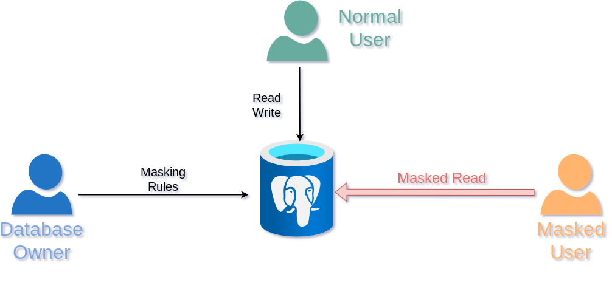

# 2- Dynamic Masking

💡 With Dynamic Masking, the database owner can hide personal data for
some users, while other users are still allowed to read and write the
authentic data.

## Requirements

**Please check out the [intro](tutorials/0-intro/) of this tutorial if
you haven't read it yet**

## The Story

Paul has 2 employees:

- Jack is operating the new sales application, he needs access to the
  real data. He is what the GPDR would call a **\"data processor\"**.
- Pierre is a data analyst who runs statistic queries on the database.
  He should not have access to any personal data.

## How it works



## Objectives

In this section, we will learn:

- How to write simple masking rules
- The advantage and limitations of dynamic masking
- The concept of \"Linkability\" of a person

## The `company` table

``` {.sql parse_query="False"}

DROP TABLE IF EXISTS supplier CASCADE;

DROP TABLE IF EXISTS company CASCADE;

CREATE TABLE company (
    id SERIAL PRIMARY KEY,
    name TEXT,
    vat_id TEXT UNIQUE
);
```

``` sql
INSERT INTO company
VALUES
(952,'Shadrach', 'FR62684255667'),
(194,E'Johnny\'s Shoe Store','CHE670945644'),
(346,'Capitol Records','GB663829617823')
;
```

``` sql
SELECT * FROM company;
```

| id  | name                 | vat_id         |
|-----|----------------------|----------------|
| 952 | Shadrach             | FR62684255667  |
| 194 | Johnny\'s Shoe Store | CHE670945644   |
| 346 | Capitol Records      | GB663829617823 |

## The `supplier` table

``` {.sql parse_query="False"}
CREATE TABLE supplier (
    id SERIAL PRIMARY KEY,
    fk_company_id INT REFERENCES company(id),
    contact TEXT,
    phone TEXT,
    job_title TEXT
);
```

``` sql
INSERT INTO supplier
VALUES
(299,194,'Johnny Ryall','597-500-569','CEO'),
(157,346,'George Clinton', '131-002-530','Sales manager')
;
```

``` sql
SELECT * FROM supplier;
```

| id  | fk_company_id | contact        | phone       | job_title     |
|-----|---------------|----------------|-------------|---------------|
| 299 | 194           | Johnny Ryall   | 597-500-569 | CEO           |
| 157 | 346           | George Clinton | 131-002-530 | Sales manager |

## Activate the extension

``` sql
ALTER DATABASE boutique
  SET session_preload_libraries TO 'anon';

CREATE EXTENSION IF NOT EXISTS anon;

SELECT anon.init();
```

## Dynamic Masking

### Activate the masking engine

``` {.sql parse_query="False"}
ALTER DATABASE boutique
  SET anon.transparent_dynamic_masking TO true;
```

### Masking a role

``` sql
SECURITY LABEL FOR anon ON ROLE pierre IS 'MASKED';

GRANT pg_read_all_data to pierre;
```

Now connect as Pierre and try to read the supplier table:

``` {.sql user="pierre"}
SELECT * FROM supplier;
```

| id  | fk_company_id | contact        | phone       | job_title     |
|-----|---------------|----------------|-------------|---------------|
| 299 | 194           | Johnny Ryall   | 597-500-569 | CEO           |
| 157 | 346           | George Clinton | 131-002-530 | Sales manager |

For the moment, there is no masking rule so Pierre can see the original
data in each table.

## Masking the supplier names

Connect as Paul and define a masking rule on the supplier table:

``` sql
SECURITY LABEL FOR anon ON COLUMN supplier.contact
  IS 'MASKED WITH VALUE $$CONFIDENTIAL$$';
```

------------------------------------------------------------------------

Now connect as Pierre and try to read the supplier table again:

``` {.sql user="pierre"}
SELECT * FROM supplier;
```

| id  | fk_company_id | contact      | phone       | job_title     |
|-----|---------------|--------------|-------------|---------------|
| 299 | 194           | CONFIDENTIAL | 597-500-569 | CEO           |
| 157 | 346           | CONFIDENTIAL | 131-002-530 | Sales manager |

------------------------------------------------------------------------

Now connect as Jack and try to read the real data:

``` {.sql user="jack"}
SELECT * FROM supplier;
```

| id  | fk_company_id | contact        | phone       | job_title     |
|-----|---------------|----------------|-------------|---------------|
| 299 | 194           | Johnny Ryall   | 597-500-569 | CEO           |
| 157 | 346           | George Clinton | 131-002-530 | Sales manager |

## Exercises

### E201 - Guess who is the CEO of "Johnny's Shoe Store"

Masking the supplier contact is clearly not enough to provide anonymity.

**Connect as Pierre and write a simple SQL query that joins the
`supplier` and the `company` tables. See how that could reindentify some
suppliers based on their job and their company.**

With this request we managed to link a person to a company and we know
it's job title. Since company names and job positions are available in
many public datasets: a simple search on Linkedin or Google would give
us the real names of many of the employees of these companies...

💡 This is called **Linkability**: the ability to connect multiple
records concerning the same data subject.

### E202 - Anonymize the companies

We need to anonymize the `company` table, too. Even if they don't
contain personal information, some fields can be used to **infer** the
identity of their employees...

**Connect as Paul and write 2 masking rules (security labels) for the
company table.**

- The first one will replace the `name` field with a fake name.
- The second rule will replace the `vat_id` with a random sequence of 10
  characters

💡 Go to
the[documentation](https://postgresql-anonymizer.readthedocs.io/en/stable/)
and look at the [faking functions](masking_functions#faking) and the
[random functions](masking_functions#randomization) !

Connect as Pierre and check that he cannot view the real company info.

Connect as Jack and check that he can view the real values.

### E203 - Pseudonymize the company name

Because of dynamic masking, the fake values will be different every time
Pierre tries to read the table.

Pierre would like to have always the same fake values for a given
company.

💡 **This is called pseudonymization.**

**Connect as Paul and write a new masking rule over the `vat_id` field
by generating a hash of 10 characters using the `anon.digest()`
function.**

**Write a new masking rule over the `name` field by using a
[pseudonymizing function](masking_functions#pseudonymization).**

## Solutions

### S201

``` {.sql user="pierre"}
SELECT s.id, s.contact, s.job_title, c.name
FROM supplier s
JOIN company c ON s.fk_company_id = c.id;
```

| id  | contact      | job_title     | name                 |
|-----|--------------|---------------|----------------------|
| 299 | CONFIDENTIAL | CEO           | Johnny\'s Shoe Store |
| 157 | CONFIDENTIAL | Sales manager | Capitol Records      |

### S202

``` sql
SECURITY LABEL FOR anon ON COLUMN company.name
  IS 'MASKED WITH FUNCTION anon.dummy_company_name()';

SECURITY LABEL FOR anon ON COLUMN company.vat_id
IS 'MASKED WITH FUNCTION anon.random_string(10)';
```

Now connect as Pierre and read the table again:

``` {.sql user="pierre"}
SELECT * FROM company;
```

| id  | name                       | vat_id     |
|-----|----------------------------|------------|
| 952 | Quigley and Feest and Sons | IQz8nNJzNN |
| 194 | McClure and Sons           | wxpIxYMWUw |
| 346 | Maggio and Heaney and Sons | eDlESuTcWE |

Pierre will see different "fake data" every time he reads the table:

``` {.sql user="pierre"}
SELECT * FROM company;
```

| id  | name                       | vat_id     |
|-----|----------------------------|------------|
| 952 | Huel and Rath Group        | p3bxk1BLGZ |
| 194 | Ankunding Inc              | cDp1XFJRtJ |
| 346 | Thompson and Schultz Group | JcPoPogE6U |

Jack still sees the real data

``` {.sql user="jack"}
SELECT * FROM company;
```

| id  | name                 | vat_id         |
|-----|----------------------|----------------|
| 952 | Shadrach             | FR62684255667  |
| 194 | Johnny\'s Shoe Store | CHE670945644   |
| 346 | Capitol Records      | GB663829617823 |

### S203

``` sql
SECURITY LABEL FOR anon ON COLUMN company.vat_id
IS $$ MASKED WITH FUNCTION anon.left(anon.digest(vat_id, 'xxx', 'md5'),10) $$;
```

``` sql
SECURITY LABEL FOR  anon ON COLUMN company.name
  IS 'MASKED WITH FUNCTION anon.pseudo_company(id)';
```

Connect as Pierre and read the table multiple times:

``` {.sql user="pierre"}
SELECT * FROM company;
```

| id  | name            | vat_id     |
|-----|-----------------|------------|
| 952 | Wilkinson LLC   | 2db762afa4 |
| 194 | Johnson PLC     | 61fddf8d83 |
| 346 | Young-Carpenter | 86fe3f164c |

``` {.sql user="pierre"}
SELECT * FROM company;
```

| id  | name            | vat_id     |
|-----|-----------------|------------|
| 952 | Wilkinson LLC   | 2db762afa4 |
| 194 | Johnson PLC     | 61fddf8d83 |
| 346 | Young-Carpenter | 86fe3f164c |

Now the fake company name is always the same.
