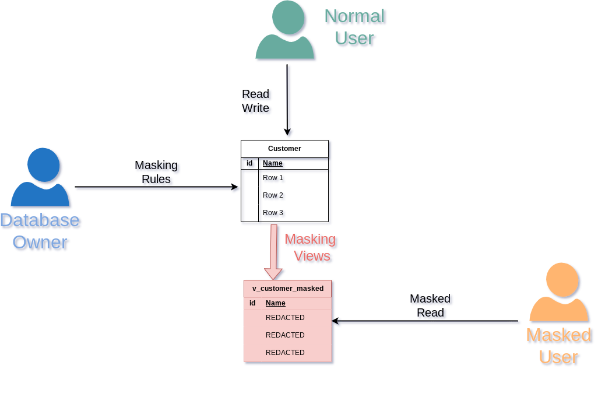

# 4 - Generalization

> The main idea of generalization is to `blur` the original data. For
> example, instead of saying `Mister X was born on July 25, 1989`, we
> can say `Mister X was born is the 80's`. The information is still
> true, but it is less precise and it can\'t be used to reidentify the
> subject.

## The Story

Paul hired dozens of employees over the years. He kept a record of their
hair color, size and medical condition.

Paul wants to extract weird stats from these details. He provides
generalized views to Pierre.

## How it works



## Learning Objective

In this section, we will learn:

-   The difference between masking and generalization
-   The concept of `K-anonymity`

## The `employee` table

``` sql
DROP TABLE IF EXISTS employee CASCADE;
CREATE TABLE employee ( id INT PRIMARY KEY, full_name  TEXT, first_day DATE, last_day DATE, height INT, hair TEXT, eyes TEXT, size TEXT, asthma BOOLEAN, CHECK(hair = ANY(ARRAY['bald','blond','dark','red'])), CHECK(eyes = ANY(ARRAY['blue','green','brown'])) , CHECK(size = ANY(ARRAY['S','M','L','XL','XXL'])) );
```

!!! danger This is awkward and illegal.

Loading the data:

``` sql
INSERT INTO employee
VALUES (1,'Luna Dickens','2018-07-22','2018-12-15',180,'blond','blue','L',TRUE),
       (2,'Paul Wolf','2020-01-15',NULL,177,'bald','brown','M',FALSE),
       (3,'Rowan Hoeger','2018-12-01','2018-12-15',202,'dark','blue','XXL',TRUE) ;
```

``` sql
SELECT count(*)
FROM employee;
```

| count |
|-------|
| 3     |

``` sql
SELECT full_name,
       first_day,
       hair,
       SIZE,
       asthma
FROM employee
LIMIT 3;
```

| full_name    | first_day  | hair  | size | asthma |
|--------------|------------|-------|------|--------|
| Luna Dickens | 2018-07-22 | blond | L    | True   |
| Paul Wolf    | 2020-01-15 | bald  | M    | False  |
| Rowan Hoeger | 2018-12-01 | dark  | XXL  | True   |

## Data suppression

Paul wants to find if there's a correlation between asthma and the eyes
color.

He provides the following view to Pierre.

``` sql
DROP MATERIALIZED VIEW IF EXISTS v_asthma_eyes;


CREATE MATERIALIZED VIEW v_asthma_eyes AS
SELECT eyes,
       asthma
FROM employee;
```

``` sql
SELECT *
FROM v_asthma_eyes
LIMIT 3;
```

| eyes  | asthma |
|-------|--------|
| blue  | True   |
| brown | False  |
| blue  | True   |

Pierre can now write queries over this view.

``` sql
SELECT eyes,
       100*COUNT(1) FILTER (
                            WHERE asthma) / COUNT(1) AS asthma_rate
FROM v_asthma_eyes
GROUP BY eyes;
```

| eyes  | asthma_rate |
|-------|-------------|
| brown | 0           |
| blue  | 100         |

Pierre just proved that asthma is caused by green eyes.

## K-Anonymity

The `asthma` and `eyes` columns are considered as indirect identifiers.

``` sql
SECURITY LABEL
FOR k_anonymity ON COLUMN v_asthma_eyes.eyes IS 'INDIRECT IDENTIFIER';

SECURITY LABEL
FOR k_anonymity ON COLUMN v_asthma_eyes.asthma IS 'INDIRECT IDENTIFIER';
```

``` sql
SELECT anon.k_anonymity('v_asthma_eyes');
```

| k_anonymity |
|-------------|
| 1           |

The v_asthma_eyes has \'2-anonymity\'. This means that each
quasi-identifier combination (the \'eyes-asthma\' tuples) occurs in at
least 2 records for a dataset.

In other words, it means that each individual in the view cannot be
distinguished from at least 1 (k-1) other individual.

## Range and Generalization functions

``` sql
DROP MATERIALIZED VIEW IF EXISTS v_staff_per_month;

CREATE MATERIALIZED VIEW v_staff_per_month AS
SELECT anon.generalize_daterange(first_day, 'month') AS first_day,
       anon.generalize_daterange(last_day, 'month') AS last_day
FROM employee;
```

``` sql
SELECT *
FROM v_staff_per_month
LIMIT 3;
```

| first_day                 | last_day                  |
|---------------------------|---------------------------|
| \[2018-07-01, 2018-08-01) | \[2018-12-01, 2019-01-01) |
| \[2020-01-01, 2020-02-01) | (None, None)              |
| \[2018-12-01, 2019-01-01) | \[2018-12-01, 2019-01-01) |

Pierre can write a query to find how many employees were hired in
november 2021.

``` sql
SELECT COUNT(1) FILTER (
                        WHERE make_date(2019, 11, 1) BETWEEN lower(first_day) AND COALESCE(upper(last_day), now()) )
FROM v_staff_per_month;
```

| count |
|-------|
| 0     |

### Declaring the indirect identifiers

Now let's check the k-anonymity of this view by declaring which columns
are indirect identifiers.

``` sql
SECURITY LABEL
FOR k_anonymity ON COLUMN v_staff_per_month.first_day IS 'INDIRECT IDENTIFIER';

SECURITY LABEL
FOR k_anonymity ON COLUMN v_staff_per_month.last_day IS 'INDIRECT IDENTIFIER';


SELECT anon.k_anonymity('v_staff_per_month');
```

In this case, the k factor is 1 which means that at least one unique
individual can be identified directly by his/her first and last dates.

## Exercises

### E401 - Simplify `v_staff_per_month` and decrease granularity

Generalizing dates per month is not enough. Write another view called
`v_staff_per_year` that will generalize dates per year.

Also simplify the view by using a range of int to store the years
instead of a date range.

### E402 - Staff progression over the years

How many people worked for Paul for each year between 2018 and 2021?

### E403 - Reaching 2-anonymity for the `v_staff_per_year` view

What is the k-anonymity of `v_staff_per_month_years`?

## Solutions

### S401

``` sql
DROP MATERIALIZED VIEW IF EXISTS v_staff_per_year;


CREATE MATERIALIZED VIEW v_staff_per_year AS
SELECT int4range(extract(YEAR
                         FROM first_day)::INT, extract(YEAR
                                                       FROM last_day)::INT, '[]') AS period
FROM employee;
```

!!! tip '\[\]' will include the upper bound

------------------------------------------------------------------------

``` sql
SELECT *
FROM v_staff_per_year
LIMIT 3;
```

| period        |
|---------------|
| \[2018, 2019) |
| \[2020, None) |
| \[2018, 2019) |

### S402

``` sql
SELECT YEAR,
       COUNT(1) FILTER (
                        WHERE YEAR <@ period )
FROM generate_series(2018, 2021) YEAR,
                                 v_staff_per_year
GROUP BY YEAR
ORDER BY YEAR ASC;
```

| year | count |
|------|-------|
| 2018 | 2     |
| 2019 | 0     |
| 2020 | 1     |
| 2021 | 1     |

### S403

``` sql
SECURITY LABEL
FOR k_anonymity ON COLUMN v_staff_per_year.period IS 'INDIRECT IDENTIFIER';


SELECT anon.k_anonymity('v_staff_per_year');
```
